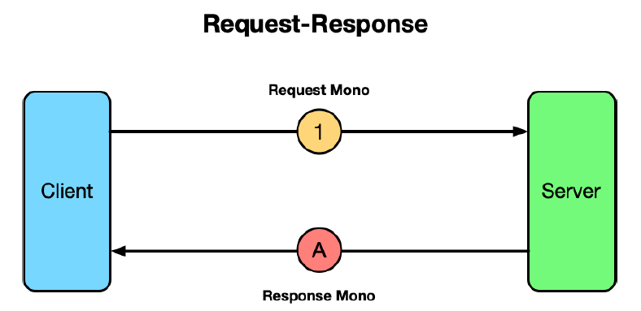
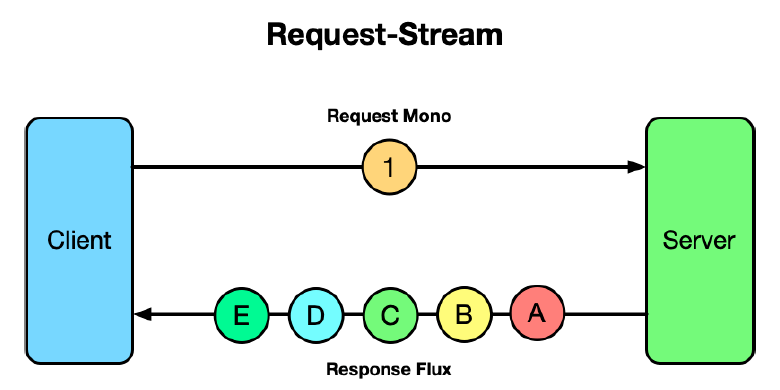
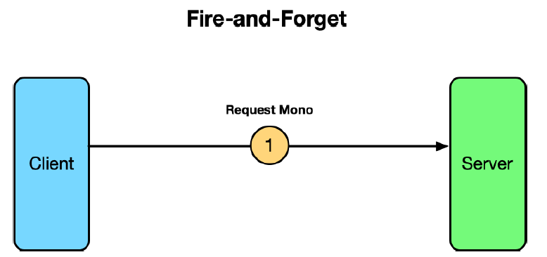
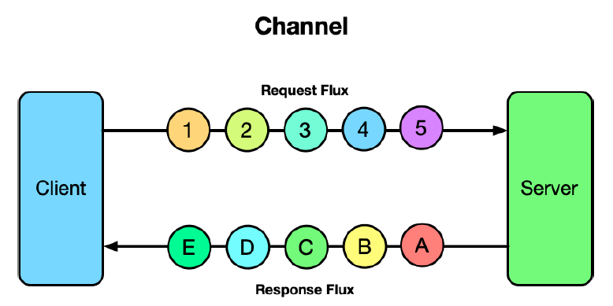

# 14.1 介绍 RSocket

RSocket 是一种二进制应用程序协议，它是异步的，基于响应式流。换句话说，RSocket 提供了应用程序之间的异步通信，支持我们在第 12 章学习的，完全一致的响应模型类型（如 Flux 和 Mono）。

作为基于 HTTP 通信的替代方案，它更加灵活，提供了四种不同的通信模型：`请求/响应`、`请求/流`、`即发即忘 `和 `通道`。

`请求/响应`（Request-Response）是 RSocket 最熟悉的通信模型，它模仿了典型的 HTTP 通信方式。在`请求/响应`模型中，客户端发出一个请求到服务器，服务器以单个响应进行反馈。如图 14.1 所示，使用响应式的 Mono 类型定义 `请求/响应`。

**图14.1 RSocket 的 `请求/响应 `通信模型。** 

虽然 `请求/响应` 模型看起来与 HTTP 提供的通信模型等效，但要理解 RSocket 本质上是非阻塞的，并且基于响应式类型。尽管客户端仍将等待服务器的答复，但底层是非阻塞和响应式的，那么就可以更高效地被线程使用。

`请求/流` 通信模型类似于 `请求/响应`，只是在客户端向服务器发送了一个请求后，服务器以零个或多个流进行响应。图 14.2 说明了 `请求/流` 模型，使用 Mono 进行请求，使用 Flux 进行响应。

**图14.2 RSocket 的 `请求/流 `通信模型。** 

在某些情况下，客户端可能需要向服务器发送数据，但不需要响应。RSocket 为这些情况提供了 `即发即忘` 模型，如图 14.3 所示。

**图14.3 RSocket 的 `即发即忘 ` 通信模型。** 

在 `即发即忘 ` 模型中，客户端向服务器发送请求，但服务器进行回复。

最后，RSocket 最灵活的通信模型是 `通道` 模型。在 `通道` 模型，客户端与服务器打开一个双向通道，每个通道都可以向对方随时发送数据。图 14.4 说明了 `通道` 通信方式。

**图14.4 RSocket 的 `通道`  通信模型。** 

RSocket 支持多种语言和平台，包括 Java、JavaScript、Kotlin、.NET、GO 和 C++。Spring 的最新版本提供了对 RSocket 的完美支持，可以用熟悉的 Spring 用法轻松创建服务器和客户端。

让我们深入了解如何创建四种通信模型的 RSocket 服务器和客户端。
