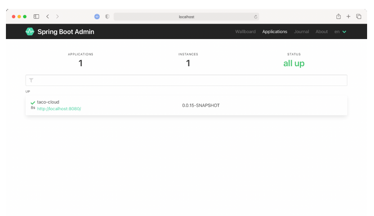

# 16.1.2 注册 Admin 客户端

Admin 服务端，是一个独立于其他 Spring Boot 应用程序的应用程序。要显示来自于其他应用程序的 Actuator 数据，您必须以某种方式使 Admin 服务端感知到其他应用程序。所在要注册 Spring Boot Admin 客户端，有如下两种方式：

* 每个应用程序都向 Admin 服务端显式注册自己。
* 管理服务器通过 Eureka 服务注册中心自动发现客户端。

我们将重点讨论，如何把各个 Spring Boot 应用程序配置为 Spring Boot Admin 客户端，以便可以在 Admin 服务端上注册自己。有关使用 Eureka 的详细信息，请参阅 Spring Cloud 文档 https://docs.spring.io/spring-cloud-netflix/docs/current/reference/html/ 或 由约翰·卡内尔和伊利·瓦伊卢波·桑切斯合著的《Spring 微服务实战》第二版。

为了把 Spring Boot 应用程序注册为 Admin 客户端，您必须在其构建时包含 Spring Boot Admin 客户端 starter。您可以使用 Initializr 轻松添加依赖关系，只需选中 Spring Boot Admin \(Client\) 的复选框。或者您可以为 Maven 构建的 Spring Boot 应用程序添加如下的 `<dependency>` ：

```markup
<dependency>
  <groupId>de.codecentric</groupId>
  <artifactId>spring-boot-admin-starter-client</artifactId>
</dependency>
```

客户端依赖库就绪后，还需要配置 Admin 服务端位置，以便客户端可以自行注册。为此，您需要设置 spring.boot.admin.client.url 属性，将其设置为 Admin 服务端的根 url：

```yaml
spring:
  boot:
    admin:
      client:
        url: http://localhost:9090
```

请注意，还设置了 spring.application.name 属性。此属性在多个 Spring 项目中使用，用于识别应用程序。在本例中，作为一个名称标签在 Admin 服务端注册。



虽然在图 16.3 中，没有太多关于 Taco Cloud 服务的信息，但仍然显示了应用程序的正常运行时间，以及 Spring Boot Maven 插件配置的构建产物（正如我们在第 16.3.1 节中讨论的），还有构建产物的版本号。请放心，在您单击 Admin 服务端中的应用之后，还有很多其他运行时细节可以查看。我们将在第 16.2 节中，更深入地了解 Admin 服务端的功能。

现在，您已经向 Admin 服务端注册了一些 Taco Cloud 服务，让我们看看 Admin 服务端都提供了什么。

