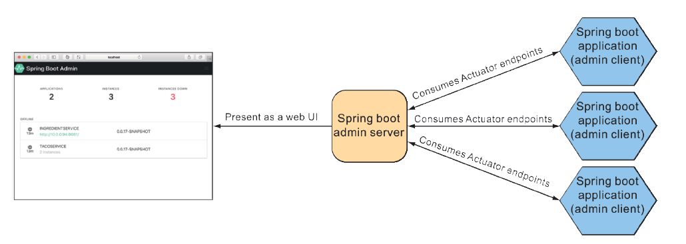

# 16.1 使用 SpringBoot Admin

使用 Actuator 端点的数据，构建一个易于查看的应用是不是有意义？开发这样的 web 应用是不是很困难？我被问过好多次这样的问题。我回应说，Actuator 端点只是一个 REST API，因此，这是可以做的。但为什么要自己做呢？codecentric AG （[https://www.codecentric.de/](https://www.codecentric.de/)），一家总部位于德国的软件和咨询公司，已经为您做了这项工作。

Spring Boot Admin 是一个管理型前端 web 应用程序，它使 Actuator 端点更易于人类使用。它分为两个主要组件：Spring Boot Admin 服务端及其客户端。服务端收集和管理数据，显示从一个或多个 Spring Boot 应用程序获得的 Actuator 数据。提供数据的应用程序，被标识为 Spring Boot Admin 客户端，如图16.1所示:

**图16.1 Spring Boot Admin 服务端，使用来自一个或多个 Spring Boot 应用程序的 Actuator 端点数据，并显示在基于 web 的 UI 中。** 

您要将 Taco Cloud 中的每个应用程序（微服务），都注册为 Spring Boot Admin 的客户端。首先，您需要设置 Spring Boot Admin 服务端接收每个客户端的 Actuator 信息。
