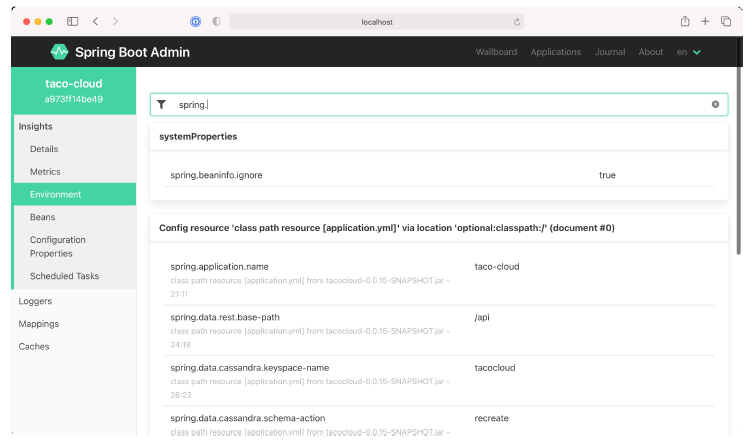

# 16.2.3 检查环境属性

Actuator 的 `/env` 端点，返回来自于所有属性源的 Spring 可用的属性。尽管 JSON 格式的响应人为读取并不是太困难，但 Admin 服务端以更美观的形式，在 Environment 选项卡下进行展示（图 16.7）。

**图16.7 Environment 选项卡显示环境属性，还包括覆盖和筛选这些属性值的选择。** 

因为可能有数百个属性，所以可以根据属性名称或值进行筛选。图 16.7 显示了筛选出的属性列表，其名称或值包含文本“spring.”。Admin 服务端也允许您设置或覆盖属性，使用 Environment Manager 部分提供的表单进行。
