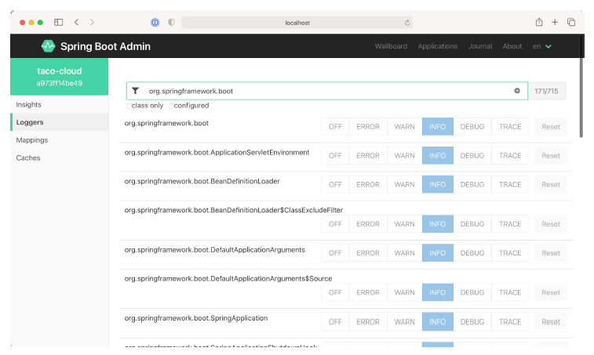

# 16.2.4 查看并设置 log 级别

Actuator 的 `/loggers` 端点，有助于了解或修改应用程序的日志记录级别。Admin 服务端的 Loggers 选项卡，为 `/loggers` 端点添加了一个易于使用的 UI。在图 16.8 中，显示了按名称 org.springframework.boot 筛选的日志记录列表。

**图16.8 Loggers 选项卡显示应用程序中，包和类的日志记录级别，并允许您覆盖这些级别。** 

默认情况下，Admin 服务端显示所有包和类的日志记录级别。可以按名称（仅适用于类）或日志记录级别（显示配置，而不是从根记录器继承）筛选这些内容。

