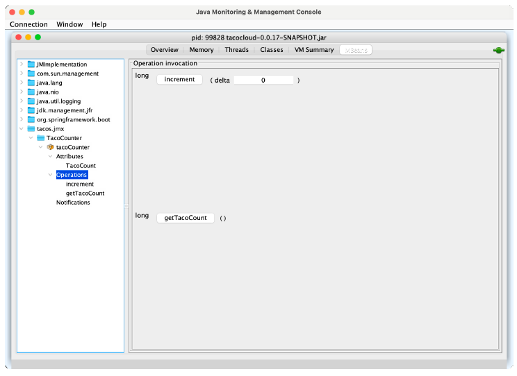

# 17.2 创建自己的 MBean

Spring 可以轻松地将任何您想要的 bean 公开为 JMX MBean。你要做的就是在类上添加 @ManagedResource 注解，然后在方法或属性上添加 @ManagedOperation 或 @ManagedAttribute 注解。Spring 会进行其他必须的工作。

例如，假设您想提供一个 MBean，来跟踪通过 Taco Cloud 订购了多少玉米卷。您可以定义一个服务 bean 来记录已订购的玉米卷数量。下面的列表显示了实现这个功能的服务。

**程序清单 18.1 一个 MBean，它统计创建了多少个玉米卷**
```java
package tacos.jmx;
import java.util.concurrent.atomic.AtomicLong;
import org.springframework.data.rest.core.event.AbstractRepositoryEventListener;
import org.springframework.jmx.export.annotation.ManagedAttribute;
import org.springframework.jmx.export.annotation.ManagedOperation;
import org.springframework.jmx.export.annotation.ManagedResource;
import org.springframework.stereotype.Service;
import tacos.Taco;
import tacos.data.TacoRepository;

@Service
@ManagedResource
public class TacoCounter
              extends AbstractRepositoryEventListener<Taco> {

  private AtomicLong counter;
  public TacoCounter(TacoRepository tacoRepo) {
    tacoRepo
        .count()
        .subscribe(initialCount -> {
          this.counter = new AtomicLong(initialCount);
        });
  }

  @Override
  protected void onAfterCreate(Taco entity) {
    counter.incrementAndGet();
  }

  @ManagedAttribute
  public long getTacoCount() {
    return counter.get();
  }

  @ManagedOperation
  public long increment(long delta) {
    return counter.addAndGet(delta);
  }
}
```

TacoCounter 类加了 @Service 注解，将通过组件扫描自动在 Spring 上下文中生成 bean 实例。还可以用 @ManagedResource 注解，以表明这个 bean 也应该是 MBean。作为 MBean，它将公开一个属性和一个操作。`getTacoCount()` 方法用了 @ManagedAttribute 注解，因此它将作为 MBean 属性公开，而 `increment()` 方法用了 @ManagedOperation 注解，将其作为 MBean 操作公开。

图 17.4 显示了 TacoCounter MBean 在 JConsole 中的显示方式。



**图 17.4 TacoCounter 公开的操作和属性如 JConsole 所示**

TacoCounter 还有另一个秘密，尽管它与 JMX 无关。因为它扩展了 AbstractRepositoryEventListener，所以当通过 TacoRepository 保存 Taco 时，将发送持久化事件。在这种情况下，只要创建新的 Taco 对象并保存，就会调用 `onAfterCreate()` 方法，它将计数器加 1。但是 AbstractRepositoryEventListener 还提供了几种处理前后事件的方法，如在创建、保存或删除对象操作时。

使用 MBean 操作和属性在很大程度上是一种拉式操作。也就是，即使 MBean 属性的值发生更改，在通过 JMX 客户端再次访问查看前是不知道的。让我们反过来看看，如何从 MBean 推送通知到 JMX 客户端。

