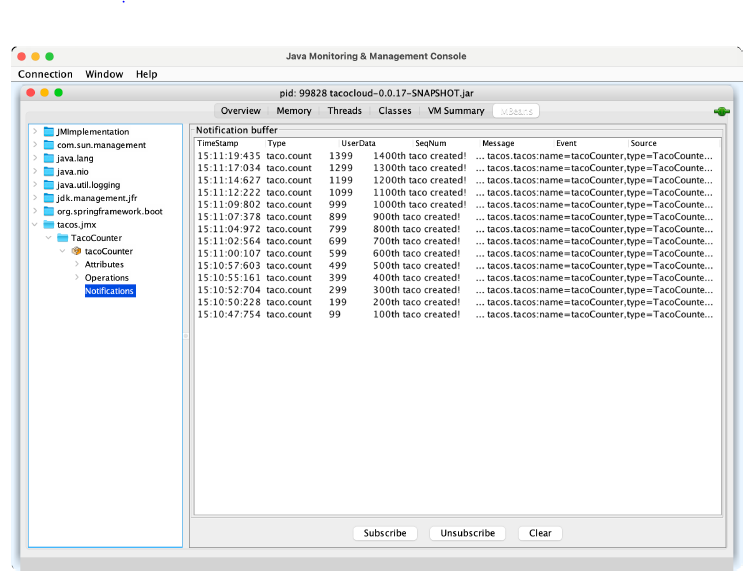

# 17.3 发送通知

MBean 可以使用 Spring 的 NotificationPublisher，将通知推送到感兴趣的 JMX 客户端。NotificationPublisher 有一个 `sendNotification()` 方法，当给定 Notification 对象时，会将通知发布到任何已经订阅此 MBean 的 JMX 客户端。

为了使 MBean 能够发布通知，它必须实现 NotificationPublisherAware 接口，该接口要求实现 `setNotificationPublisher()` 方法。例如，假设每生产 100 个玉米卷，您要发布一次通知，可以修改 TacoCounter 类，实现 NotificationPublisherAware 并使用注入的 NotificationPublisher 发送通知。下面的清单显示了，实现此功能后的 TacoCounter。

****程序清单 18.2 每生产 100 个玉米卷就发送通知**
```java
package tacos.jmx;

import java.util.concurrent.atomic.AtomicLong;
import org.springframework.data.rest.core.event.AbstractRepositoryEventListener;
import org.springframework.jmx.export.annotation.ManagedAttribute;
import org.springframework.jmx.export.annotation.ManagedOperation;
import org.springframework.jmx.export.annotation.ManagedResource;
import org.springframework.stereotype.Service;

import org.springframework.jmx.export.notification.NotificationPublisher;
import org.springframework.jmx.export.notification.NotificationPublisherAware;
import javax.management.Notification;

import tacos.Taco;
import tacos.data.TacoRepository;

@Service
@ManagedResource
public class TacoCounter
        extends AbstractRepositoryEventListener<Taco>
        implements NotificationPublisherAware {

  private AtomicLong counter;
  private NotificationPublisher np;

  @Override
  public void setNotificationPublisher(NotificationPublisher np) {
    this.np = np;
  }

  ...

  @ManagedOperation
  public long increment(long delta) {
    long before = counter.get();
    long after = counter.addAndGet(delta);
    if ((after / 100) > (before / 100)) {
      Notification notification = new Notification(
              "taco.count", this,
              before, after + "th taco created!");
      np.sendNotification(notification);
    }
    return after;
  }
}
```

在 JMX 客户端中，您需要订阅 TacoCounter MBean 以接收通知。然后，随着玉米卷的生产，每生产 100 个玉米卷，客户端将收到一条通知。图 17.5 显示了在 JConsole 中显示的通知。



**图17.5 订阅 TacoCounter MBean 的 JConsole，每 100 个玉米卷被制造出来就收到一次通知。**</br>

推送通知是应用程序主动向客户端发送数据和警报的好方法，而不要求客户端轮询或主动发起调用操作。

